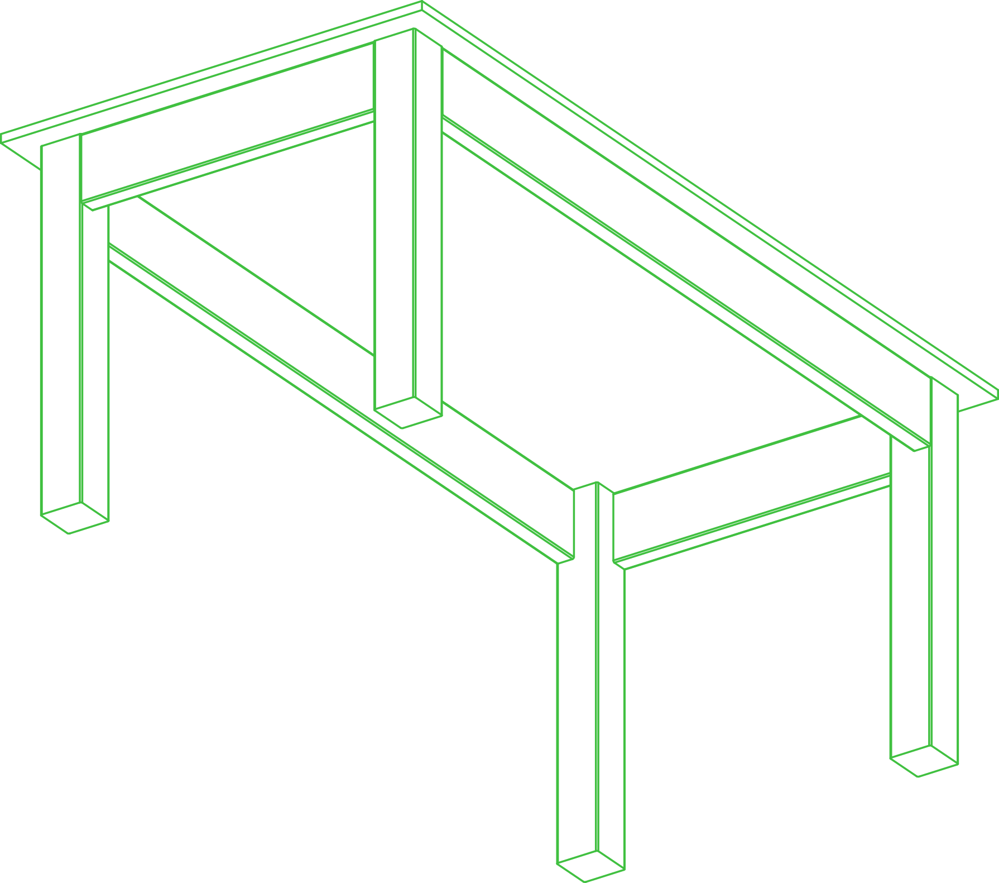
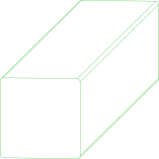

# //pub/furniture/workspace/basic

Basic furniture for low demand workspace environments

Furniture made of dimensional lumber and plywood from The Home Depot, cut
to size with a saw and nothing else.

Every component is an instance of the standard size it is
(`//pub/std/imperial/dimensional-lumber`), and names the store product it is
cut from (`//pub/svc/commerce/homedepot`) as its stock, with where the saw
cuts it. `pc test` checks that cutting that product there leaves exactly the
component, and the store's SKUs are what the lumber is bought as.


## Usage
The bill of materials of the desk, with the lumber it is cut from, is
[imperial-desk-1.md](imperial-desk-1.md). The assembly instructions, which
open with the parts to cut and where to cut them, are
`pc render -t pdf -a :imperial-desk-1` (or `-t html`).

```shell
pc inspect :imperial-desk-1
pc inspect -p length=60 -p width=30 -p height=30 :imperial-desk-1
pc test -f manufacturability :imperial-desk-1
```


## Assemblies

### imperial-desk-1
<table><tr>
<td valign=top><a href="imperial-desk-1.assy"></a></td>
<td valign=top>A desk: a 3/4 in. plywood top on four 4x4 legs, braced by a 2x6 apron on each side. Everything is cut from 8 ft. lumber and a 4x8 sheet, so the top is at most 48 x 96 in. and the desk at most 96 in. high.
</td>
<td valign=top>Parameters:<br/><ul>
<li>length: 72</li>
<li>width: 36</li>
<li>height: 30</li>
</ul>
</td>
</tr></table>

## Parts

### apron
<table><tr>
<td valign=top></td>
<td valign=top>Apron, 2x6 cut to length</td>
</tr></table>

### leg
<table><tr>
<td valign=top></td>
<td valign=top>Leg, 4x4 cut to length</td>
</tr></table>

### top
<table><tr>
<td valign=top></td>
<td valign=top>Top, 3/4 in. plywood cut to size</td>
</tr></table>

<br/><br/>

*Generated by [PartCAD](https://partcad.org/)*
